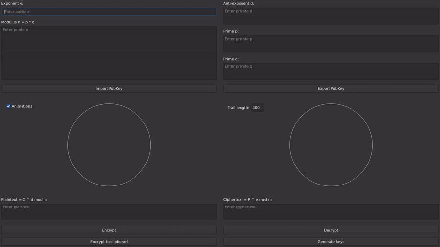

# RSA Visualization

A Qt 6 desktop application for visualizing RSA modular exponentiation.



## Features

- Visualizes modular exponentiation on a residue circle
- Shows encryption and decryption mappings
- Animates point movement through modular powers
- Supports large integers via Boost.Multiprecision
- Uses Qt 6 Widgets

## Build from source

### Dependencies

You need:

- CMake
- C++23 compiler
- Qt 6 Widgets
- Qt 6 Concurrent
- OpenSSL
- Boost headers

### Linux

```bash
cmake -S . -B build -G Ninja -DCMAKE_BUILD_TYPE=Release
cmake --build build
./build/rsa_visualization
